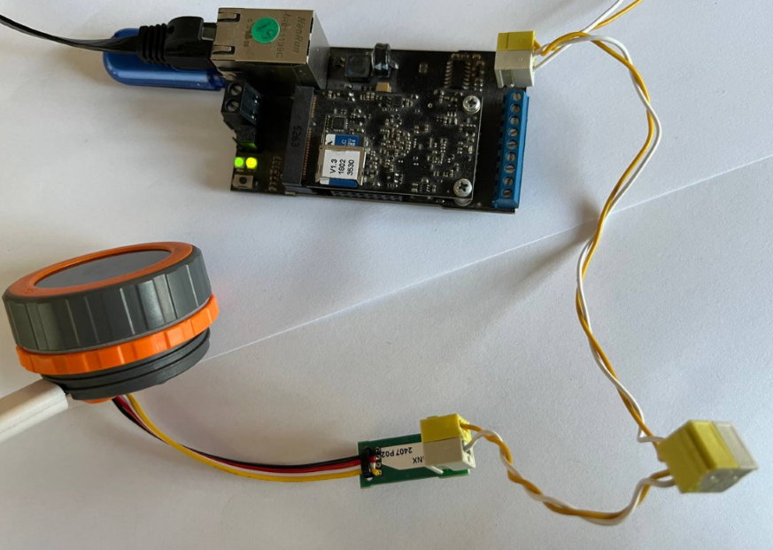
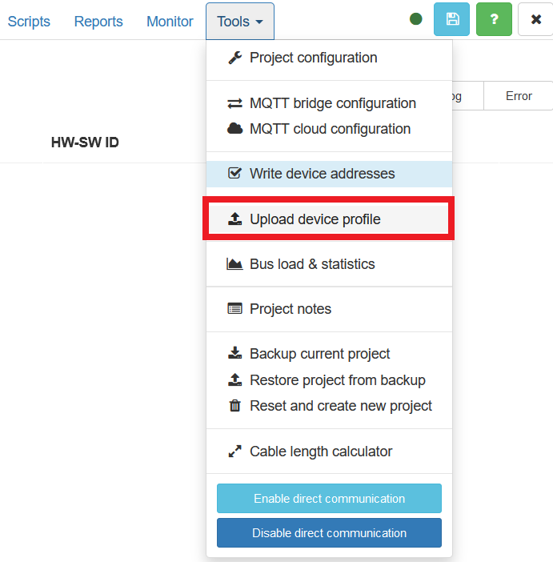
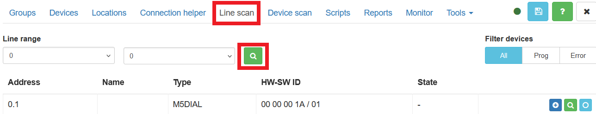
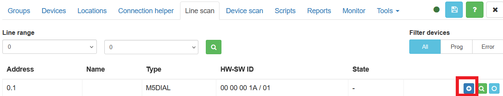
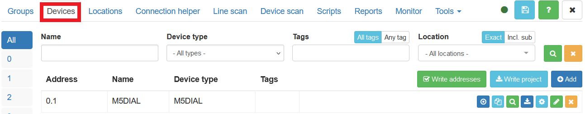
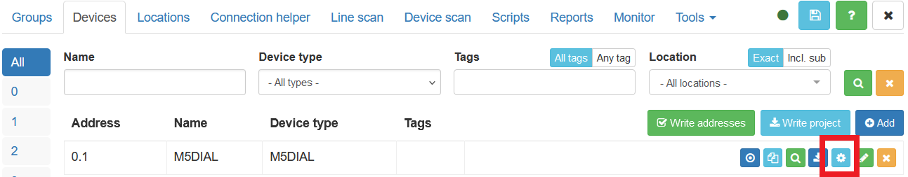
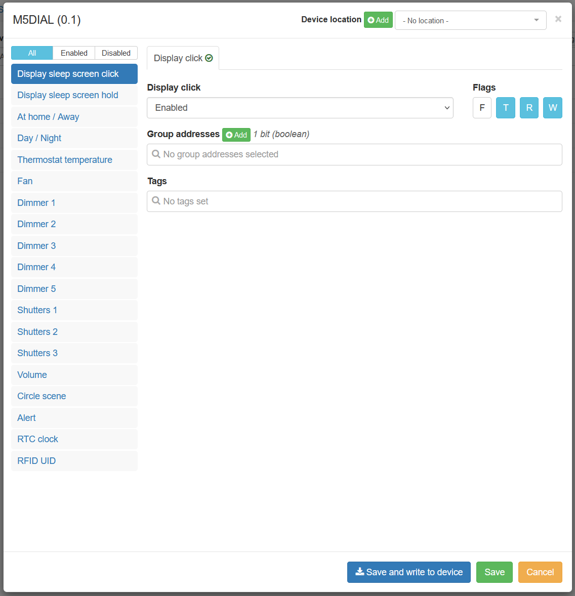
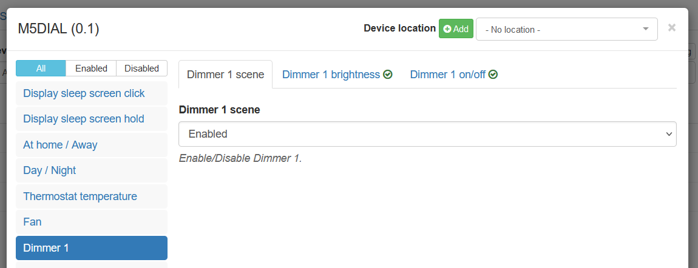
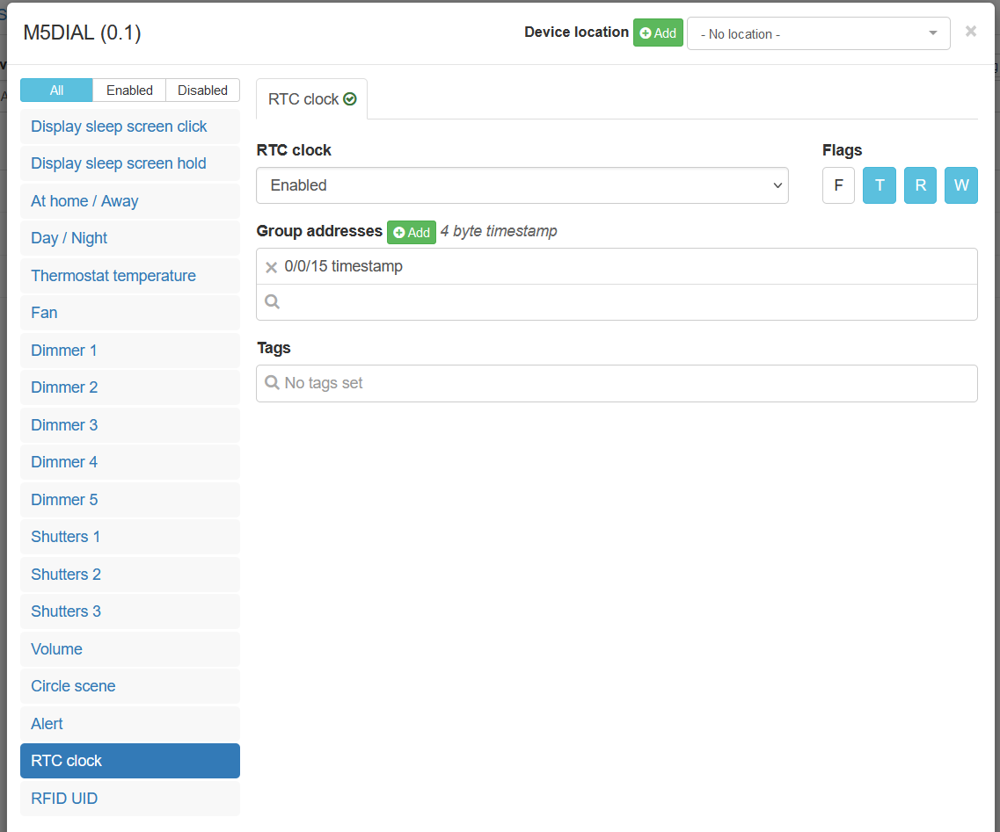

## How to use the M5Dial device:

1. You need a LogicMachine with a CANx interface

2. Update the firmware for the M5Dial device (after the update, hold down the button on the back of the device to perform a "Hard Reset")

3. Connect the M5CANX cable to the M5Dial and to the LogicMachine (to the CANx, not the KNX)

4. Power the M5Dial device (it can be powered via USB or a power supply with a voltage range of 6 to 36 volts)

5. Use the CANx application, where you first need to add the M5Dial profile to the application

6. Perform "Line scan"

7. Add device

8. Switch to tab "Devices"

9. Next, you need to configure the device - assign the group addresses that you will use and hide the scenes you don't need

You can show/hide the necessary scenes using enable/disable

10. Configure RTC-clock

Add group address (for example, 0/0/15)

Create another group address with data type "1 byte signed integer", and create an event script for this CANx group address

<pre style="font-family: 'Courier New', monospace; line-height: 1.0;">
local timezone = event.value + 1
local unix_time = os.time()
local hour = 3600
unix_time = unix_time + hour*timezone
canx.write('0/0/15', unix_time)
</pre>

In this case, 0/0/15 is the group address for RTC-clock.
Now, when you write the value of your time zone, for example, +3, to the group address "1 byte signed integer", the script will calculate the correct time and send it to the M5Dial device (which will save all the settings and reboot the M5Dial)

11. Now you can work with M5Dial product