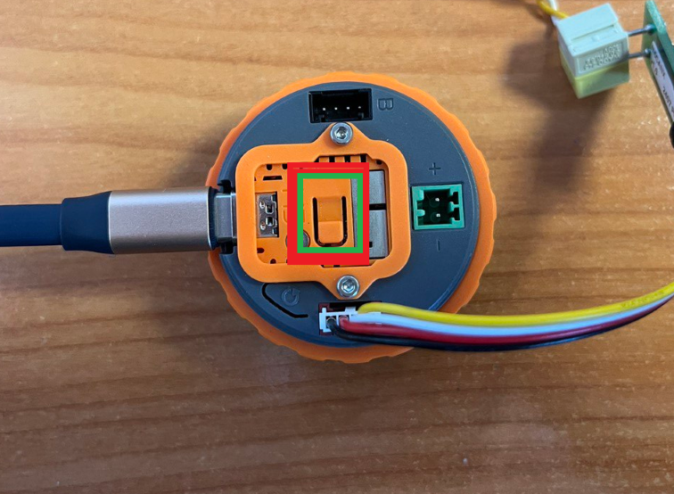
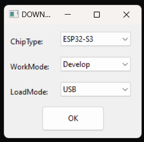
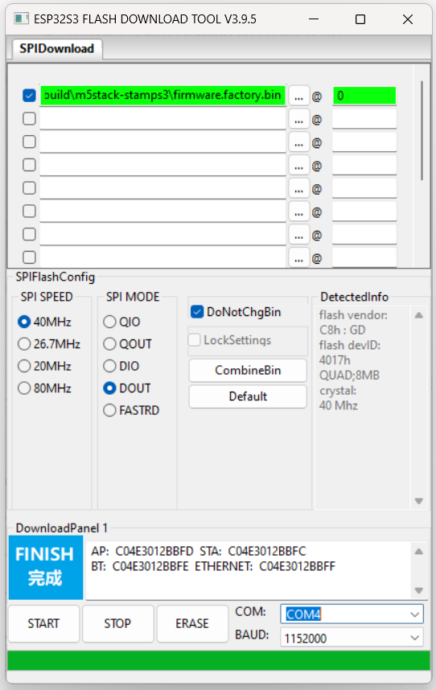

# M5Dial: Optimized Smart Environment Control via CANx Protocol

## Challenge to the Current State of Control Panels in the Market:
Existing control panels often suffer from:

* Overly complex interfaces: Forcing users to figure out numerous, often ambiguous icons.

* High cognitive load: Difficulties in recognizing and remembering icons, leading to user frustration.

* Input inaccuracy: Small touch elements leading to frequent erroneous presses.

* "Dusty corner effect": When a device is initially used out of interest, but after a few days is forgotten and stops being used altogether.

M5Dial solves common problems of smart home/building control panels by moving away from feature-overloaded interfaces and unreliable wireless communication. Our design philosophy prioritizes simplicity, reliability, and real benefit for both the end user and system integrator.

## M5Dial Approach: Designed with Purpose

M5Dial is conceived as a specialized, reliable interface node in an automation system built around LogicMachine.

Key technical advantages and design principles:

1.) User-oriented, minimalist interface:

* Contextual relevance: Users can completely hide unused functions (scenes, controls), leaving only the most necessary. This radically reduces interface clutter and improves usability.

* Intuitive grouping: Icons in the same functional group (e.g., lighting, climate) are differentiated by color, helping to quickly identify them visually and reducing the need to memorize abstract symbols.

* Elimination of erroneous presses: M5Dial uses a rotary encoder with push function (implied from phrases "click on it" and "no small buttons"), providing clear, tactile input instead of imprecise small touch elements.

2.) Consolidated functionality, reduction in the number of panels:

* M5Dial acts as a universal control point, capable of managing diverse functions that typically require separate specialized panels (e.g., thermostat, dimmer, blind control, scene activation). This simplifies wall mounting aesthetics and reduces equipment redundancy.

3.) Core based on CANx protocol:

* Reliability of wired connection: We deliberately opted against Wi-Fi for device control in favor of CANx (CAN FT) wired connection. This provides a dedicated, reliable communication bus, significantly less susceptible to interference, latency issues, and security vulnerabilities characteristic of common wireless environments.

* Seamless integration with LogicMachine and KNX: M5Dial functions as a native CANx device. Through LogicMachine, which serves as the intelligent core of the system, CANx objects are transparently mapped to KNX group addresses. This allows M5Dial to effectively control any KNX device or system function managed by LogicMachine (including any other protocols supported by LogicMachine - KNX, ZigBee, Modbus, DALI, etc.), extending its usefulness far beyond basic CANx peripherals.

4.) Designed for long-term utility:

* Priority - core functionality: Focus on reliable provision of key control functions, ensuring that the device remains an integral part of everyday life.

* Room-level versatility: Designed for installation in each room, increasing convenience. Built-in night light function (activated by click, with adjustable brightness) adds practical value beyond basic control tasks.

* Direct scene invocation: Scenes programmed in LogicMachine can be triggered via CANx binary objects with a single interaction with M5Dial, simplifying complex automation sequences for the end user.

 
M5Dial is not just another smart panel; it is a purposefully designed HMI (Human-Machine Interface) component intended for seamless integration into reliable, wired automation systems controlled by LogicMachine. Its strengths lie in the choice of protocol (CANx for reliability), direct integration path with KNX, Zigbee, ModBus, DALI, flexibly configurable but inherently simple user interface, and focus on necessary, reliable functionality. This makes it an attractive choice for projects where long-term stability, ease of use for the end client, and straightforward commissioning are paramount.

# M5Dial firmware upload

1. Download [Flash Download Tools](https://www.espressif.com/en/support/download/other-tools)

2. Connect M5Dial device to PC via USB while holding the programming button

3. Run **flash_download_tool.exe** and select the following values:

* ChipType = ESP32-S3
* WorkMode = Develop
* LoadMode = USB

4. In **SPIDownload** tab

* Tick the checkbox for the first entry in the list
* Choose the required firmware.bin file and set address (after @) to 0
* Select correct COM port as detected by the OS
* Press Start

5. Perform "HARD RESET" of M5Dial device. Disconnect power from device, and then reconnect the power, then press programming button till "HARD RESET" will be shown on M5Dial screen

6. The M5Dial device is ready to work